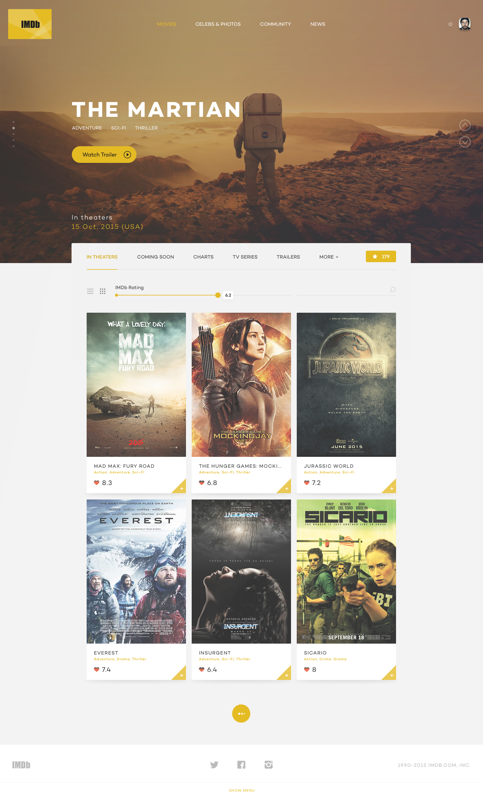

# Aula 10 - Conteúdo

## Construção de um Website Responsivo
O objetivo final do curso é a contrução de um website de catálogo informação sobre filmes em cartaz. O site será responsivo e utilizará fontes e ícones incorporados, além de plugins javascript.

O material base escolhido foi o concept do designer [George Vasyagin](https://dribbble.com/georgev) e não deverá ser utilizado para fins comerciais.

**Referência**
* [Arquivo](https://dribbble.com/shots/2266601-IMDb-design-concept/attachments/425192)

## Metodologia BEM CSS (Bloco - Elemento - Modificador)
A sigla **BEM significa block, element, modifier** e segue essas propriedades para definir uma nova metodologia de criação de nomes para classes de folhas de estilo.
A estrutura é simples:
.elementopai, .elementopai__filho, .elementopai__filho- -primeiro

* [Artigo](http://tableless.com.br/bem-um-novo-metodo-para-seu-css/)
* [Artigo](https://medium.com/@wilfernandesjr/da-necessidade-de-um-css-do-bem-7332a10c3f8d#.o1nqo7s6r)
