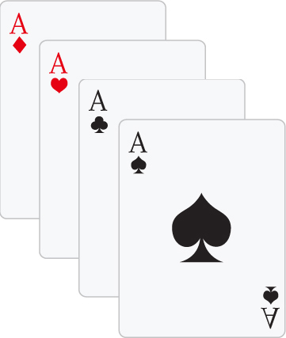

# Aula 6 - Exercícios
Para praticar o posicionamento **absolute** e a propriedade **z-index** você resolverá o posicionamento das cartas como no arquivo modelo **index.html** que está vinculado ao arquivo **estilo.css** onde deverão ser feitas as alterações.

Altere o **z-index** e as valores de **posicionamento** para que a carta de copas fique entre **ouros** e **espadas** e a carta de **paus** fique **acima de copas** e **abaixo de espadas**.

## Resultado Final
Você deverá posicionar as cartas como no exemplo abaixo sem alterar a estrutura **HTML**, **apenas o CSS**:

