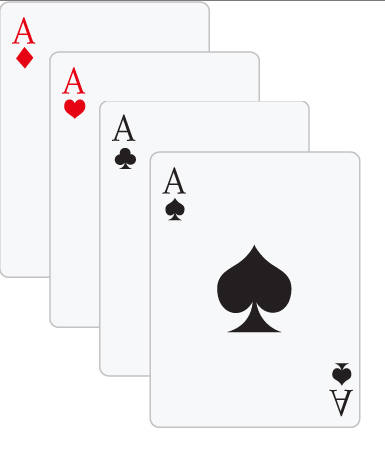

# Aula 6 - Exercícios
Para praticar o posicionamento **absolute** e a propriedade **z-index** você deverá poscionar as cartas como no arquivo **index.html**.

Altere o **z-index** para que a carta de copas fique entre **ouros** e **espadas** e a carta de **paus** fique **acima de copas** e **abaixo de espadas**.

## Aula 6 - Resultado Final
Você deverá posicionar as cartas como no exemplo abaixo sem alterar a estrutura HTML, **apenas o CSS**:

