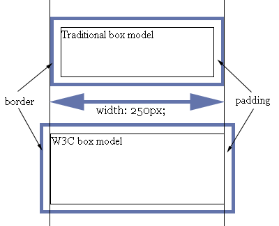

# Aula 7 - Conteúdo

## Propriedades CSS

### Teoria - Margin
A propriedade **margin** adiciona margem ao elemento. 
pode-se utilizar qualquer medida CSS (px, pt, em, %...) como tamanho da propriedade margin, além disso você pode atribuir **valores negativos**.

Exemplos:
```
/* Valores separados */
seletor { 
    margin-top: 15px; 
    margin-right: 10px;
    margin-bottom: 25px;
    margin-left: 35px;
}

/* Valores resumidos - 15px top e bottom, 10px right e left */
seletor { 
    margin: 15px 10px;
}

/* Valores resumidos - 15px para todas os elementos */
seletor { 
    margin: 15px;
}
```

### Teoria - Padding
Determina as **margens internas**, é responsável por determinar a distância **entre o conteúdo** de determinado elemento e **sua borda**.

Exemplos:
```
/* Valores separados */
seletor { 
    padding-top: 15px; 
    padding-right: 10px;
    padding-bottom: 25px;
    padding-left: 35px;
}

/* Valores resumidos - 15px top e bottom, 10px right e left */
seletor { 
    padding: 15px 10px;
}

/* Valores resumidos - 15px para todas as posições do elemento */
seletor { 
    padding: 15px;
}
```

### Teoria - Propriedade box-sizing
Por padrão, todos os elementos HTML têm o valor **box-sizing: content-box** o que indica que o tamanho dele é definido pelo seu conteúdo apenas. Trocando o valor para **box-sizing: border-box** o tamanho agora levará em conta até a borda -- ou seja, o width será a soma do conteúdo com a borda e o padding.

```
* {
	box-sizing: border-box;
}
```



**Referência:**

* [Você deveria usar box-sizing: border-box em todas as suas páginas](http://sergiolopes.org/css-box-sizing-border-box/)

### Teoria - Propriedade float
A propriedade **float** especifica quando um elemento deve **flutuar** ou não.
A propriedade **clear** é usada para controlar os elementos **float**.

**float**:
```
seletor {
	float: left;
}

seletor2 {
	float: right;
}

seletor2 {
	float: none;
}
```


**clear**:
Elementos que estiverem **flutuando** se encaixarão ao seu redor. Para eveitar isso, utilize a propriedade **clear**, que define em qual dos lados um elemento **não será permitido** flutuar:
```
div {
    clear: left;
}

div2 {
    clear: right;
}

div2 {
    clear: both;
}
```

**Referência:**

* [Entendendo float, clear e clearfix de uma vez por todas](http://edsonjunior.com/entendendo-float-clear-clearfix/)